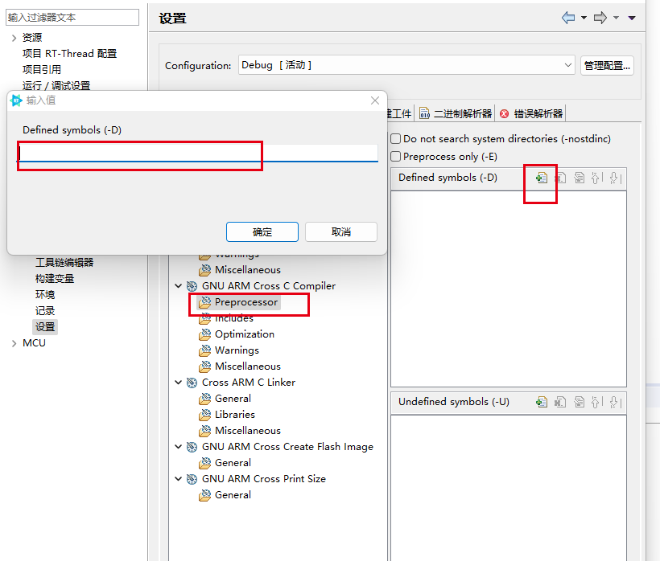
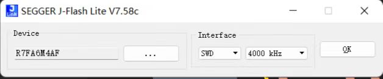
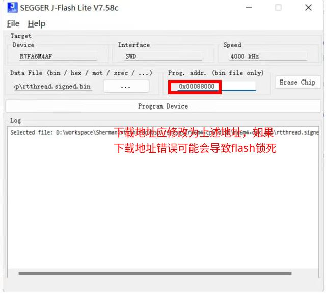
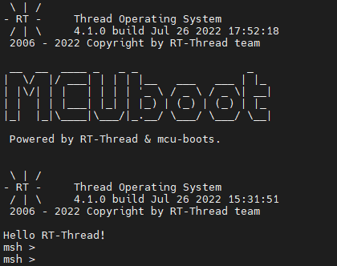

# 瑞萨 CPK-RA6M4 开发板 MCUBOOT 说明

## 简介

[MCUboot](https://docs.mcuboot.com/) 是用于 32 位微控制器的安全引导加载程序。它为微控制器系统上的引导加载程序和系统闪存布局定义了通用基础结构，并提供了一个安全的引导加载程序，可实现轻松的软件升级。本工程是将mcuboot移植至RT-Thread，并运行在CPK-RA6M4开发板上的示例工程。
* 注：本示例在构建APP时需要准备python3.3以上环境。
## 升级方式

mcuboot 支持多种升级方式，如 overwrite swap等，这里选用overwrite作为升级方式，mcuboot 会将 app镜像文件进行安全校验后，从 image0 secondary SLOT 搬运至 image0 primary SLOT，然后跳转。

## flash分区

~~~
┌───────────────────────────────────┐ 0x0104 8510
│              ......               │
├───────────────────────────────────┤ 0x00100000
│       image0 secondary SLOT       │
│                                   │
│               480KB               │
├───────────────────────────────────┤ 0x00088000
│       image0 primary SLOT         │
│                                   │
│               480KB               │
├───────────────────────────────────┤ 0x00010000
│       FLASH_AREA_BOOTLOADER       │
│                                   │
│               64KB                │
└───────────────────────────────────┘ 0x00000000
~~~

* 注：这里只是列出了当前示例工程中用到的flash的分区信息，更详细的内容可以在 {project}/ra_cfg/mcu-tools/include/sysflash/sysflash.h 中查看

## APP构建
将BSP作为APP为例（GCC工具链情况下，MDK类似），在构建APP时需要做以下修改，修改后需要编译构建APP镜像：
* 链接脚本
```
# {app}/script/memory_regions.ld
FLASH_START = 0x00010200; # 由于镜像的前0x200是镜像头，因此实际app的代码是从0x00010200开始链接的
FLASH_LENGTH = 0x00077e00;
```

* 添加全局宏定义
按照如下图所示位置添加相应宏
```
_RENESAS_RA_
_RA_BOOT_IMAGE
```


## 镜像签名
由于mcuboot在boot的阶段会对镜像进行安全校验，因此需要对APP的镜像文件签名。
#### step 1 设置变量
在 {mcuboot_dir}/ra/fsp/src/rm_mcuboot_port/rm_mcuboot_port_sign.py中，填入相关绝对路径：
```
# 密钥文件, 使用了FSP默认的root-ec-p256.pem
os.environ['MCUBOOT_IMAGE_SIGNING_KEY'] = r'{rs_mcuboot}\rs_mcuboot\ra6m4_boot\ra\mcu-tools\MCUboot\root-ec-p256.pem'
# arm-none-eabi-objcopy 路径
os.environ['MCUBOOT_APP_BIN_CONVERTER'] = r'{env}\tools\gnu_gcc\arm_gcc\mingw\bin\arm-none-eabi-objcopy.exe'
```
#### step 2 执行签名命令
在任意路径下启动命令行，执行下述命令即可，注意将下面命令的mcuboot_dir，app_dir换成实际的MCUBOOT，APP路径
~~~
python {mcuboot_dir}\ra\fsp\src\rm_mcuboot_port\rm_mcuboot_port_sign.py sign --header-size 0x200 --align 128 --max-align 128 --slot-size 0x78000 --max-sectors 15 --overwrite-only --confirm --pad-header {app_dir}\rtthread.elf {app_dir}\rtthread.signed.bin
~~~

## 下载烧录
将签名后的镜像 rtthread.signed.bin 后下载至 image0 secondary SLOT 的起始地址（0x00088000）即可







## 联系人信息

在使用过程中若您有任何的想法和建议，建议您通过以下方式来联系到我们  [RT-Thread 社区论坛](https://club.rt-thread.org/)

## 贡献代码

如果您对 CPK-RA6M4 感兴趣，并且有一些好玩的项目愿意与大家分享的话欢迎给我们贡献代码，您可以参考 [如何向 RT-Thread 代码贡献](https://www.rt-thread.org/document/site/#/rt-thread-version/rt-thread-standard/development-guide/github/github)。
